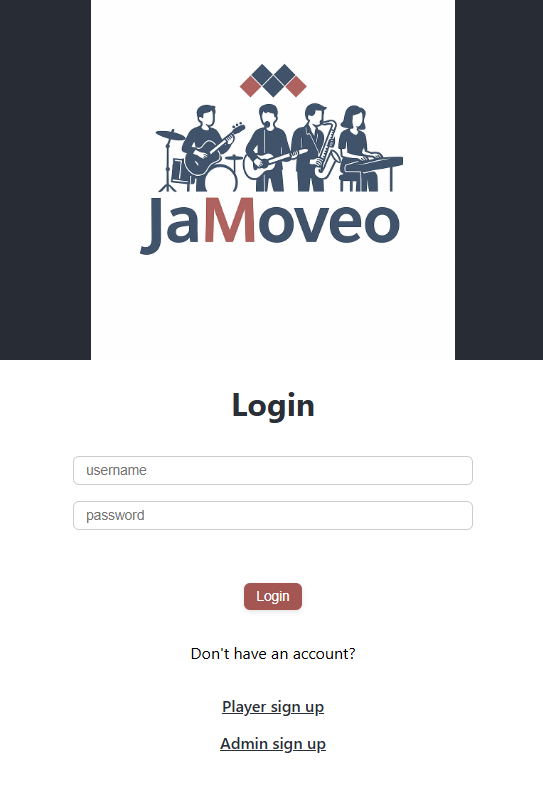

<p align="center">
  
</p>

**JaMoveo** is a real-time rehearsal web app for musicians. The platform allows singers and instrumentalists to sign in, search and display songs (with lyrics and chords), and synchronize their current song view in real-time via Socket.io.

Built as a full-stack project for a Moveo code challenge, the app offers live collaboration tools for jam sessions with clean UI, real-time updates, and accurate chord-lyric alignment.

## Motivation

This project was inspired by Moveo’s internal tradition of team jam sessions. The goal was to simulate a shared rehearsal experience where the admin can choose a song and broadcast it to all participants in real time, while preserving the structure of lyrics and chords.

---

## Live Demo

[Live App on Netlify](https://jamoveo-shay.netlify.app)

[Server deployed on Railway](https://jamoveo-production-74e5.up.railway.app)

---

## Features 

- **User authentication** – signup & login using JWT + bcrypt for both user and admin
- **Role selection** – singer / instrumentalist
- **Search songs** by name or artist with image previews
- **Display lyrics with aligned chords**
- **Admin control** – chooses the currently visible song
- **Real-time sync** across all connected clients using Socket.IO
- **Responsive UI** – mobile-friendly

---

## User Guide

### Sign Up
- Enter: username, password, and select your role (singer/instrumentalist)

There are **two separate sign-up URLs**, depending on the type of user:
- **Regular User:** go to `/signup`
- **Admin User:** go to `/admin-signup`

### Log In
- Use your username and password to log in
- Your session is saved using JWT in sessionStorage

### Admin - Search Songs
- Type a song or artist name
- Select a result to fetch full lyrics and chords

### Player
- Wait for the admin to select a song
- All users’ views are synchronized in real-time

---

## Demo Users

#### Admin - singer
Username: shay
Password: 12345

#### Player - guitar
Username: gal
Password: 12345

---

## Tech Stack

### Frontend
- React
- Tailwind CSS
- React Router
- Socket.io-client

### Backend
- Node.js
- Express.js
- Socket.IO Server
- JWT for authentication
- bcrypt for password hashing

---

## Key Challenges & Solutions

### Chord-Lyric Alignment
- **Challenge:** While crawling a chord-lyrics website, it was difficult to preserve the exact positioning of chords above the correct words, as the original HTML used complex spacing (e.g., invisible `&nbsp;` entities) to visually align them.
- **Solution:** I extracted the raw HTML of the chord line as-is, cleaned out irrelevant tags and noise, and used the cleaned structure directly in my rendering logic to maintain accurate visual alignment between chords and lyrics.

---

## Project Structure

```bash
JaMoveo/
├── client/                     # React frontend
│   ├── src/
│   │   ├── pages/              
│   │   │   ├── AdminPage.js
│   │   │   ├── LivePage.js
│   │   │   ├── LoginPage.js
│   │   │   ├── PlayerPage.js
│   │   │   ├── ResultsPage.js
│   │   │   └── SignupPage.js
│   │   ├── App.js              
│   │   ├── App.css
│   │   ├── index.js            
│   │   ├── index.css
│   │   ├── logo.png / .svg     
│   │   ├── ProtectedRoute.js   # Route guard for authenticated pages
│   │   ├── socket.js           
│
├── server/                     # Node.js backend
│   ├── routes/
│   │   ├── auth.js             
│   │   └── Tab4U.js            # HTML crawler for lyrics + chords
│   ├── models/
│   │   └── User.js             # Mongoose user model
│   ├── index.js                

```

---

## Screenshots

### Login Page
<p align="center">
  
</p>

### Search Results
<p align="center">
  
</p>

### Song Display with Chords
<p align="center">
  
</p>

---

## Author

Shay Herling  
shayherl@gmail.com  
[LinkedIn](https://linkedin.com/in/shayherl) | [GitHub](https://github.com/shayherl)

